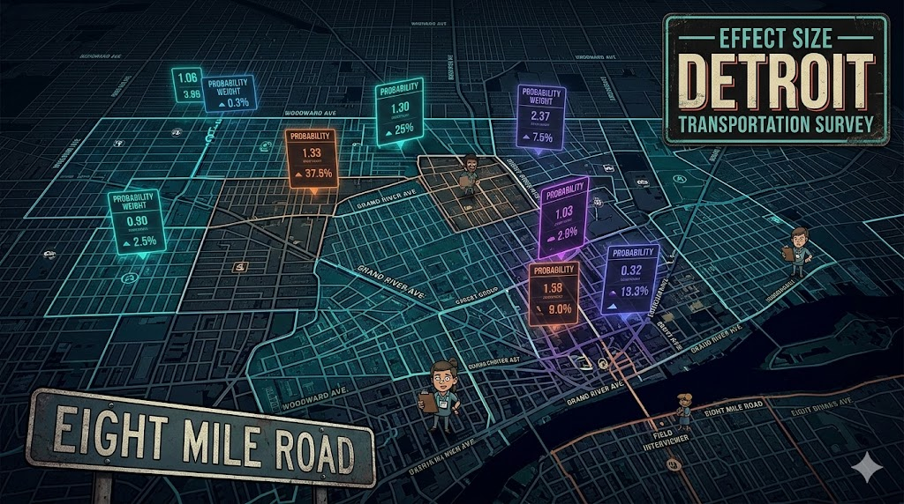

# 🚌 detroit-transit-by-design

> *"We didn't just pick 40 tracts — we designed an effect."*

**Team:** Effect Size \| **Course:** SURV745 — Practical Tools for Survey Design **Assigned:** 2/23/2026 \| **Due:** 4/20/2026



------------------------------------------------------------------------

## Project Overview

This repo contains all code, data, and documentation for a three-stage area probability sample designed to support a face-to-face survey on **transportation insecurity among Detroit, MI residents**. The design samples census tracts (PSUs) → block groups (SSUs) → persons, targeting 1,000 respondents across four age domains (18–34, 35–49, 50–64, 65+), with goals of self-weighting within domains and equal interviewer workload across PSUs.

**Final Deliverables:** - `REPORT_EffectSize.pdf` — Sampling report (10–15 pages) - `FRAME1_EffectSize.csv` / `FRAME2_EffectSize.csv` — Tract-level and BG-level frame files - `SAMPLE_EffectSize.csv` — Selected sample with probabilities and weights

------------------------------------------------------------------------

## Repo Name Options

| Name                            | Vibe                               |
|---------------------------------|------------------------------------|
| **`detroit-transit-by-design`** | Clean, descriptive, professional   |
| **`effect-size-detroit`**       | Team name front and center         |
| **`motor-city-sampler`**        | Detroit pride + survey pun         |
| **`pps-in-the-d`**              | Nerdy PPS sampling joke for locals |
| **`tract-record`**              | Census tract + track record pun 🏆 |

------------------------------------------------------------------------

## Task Breakdown & Timeline

The project spans **8 weeks** (2/23 → 4/20). Tasks are grouped into five phases.

------------------------------------------------------------------------

### 📦 Phase 1 — Setup & Frame Construction

**Deadline: March 6, 2026** *(Week 1–2)*

| \# | Task | Notes |
|-----------------|-------------------------|------------------------------|
| 1.1 | Initialize GitHub repo, set up Quarto project structure | Folders: `/data`, `/R`, `/output`, `/report` |
| 1.2 | Load and explore `Detroit_MI.xlsx` (tract- and BG-level census data) | Use `readxl`; inspect housing counts, person counts, age × sex breakdowns |
| 1.3 | Load `Census_Tract_FIPS_Code_Detroit_MI.csv` and join to Wayne County data | Filter Wayne County tracts to Detroit-only using FIPS list |
| 1.4 | Construct **Frame 1** (tract-level PSU frame) with total person counts | Include all relevant census columns; document variable codebook |
| 1.5 | Construct **Frame 2** (block group-level SSU frame) nested within sampled tracts | Include BG-level age × sex counts for MOS construction |
| 1.6 | Run QC checks: flag BGs with zero population or infeasible sampling rates | Combine small/empty BGs with neighbors as needed (see VDK Ch. 11) |

------------------------------------------------------------------------

### 📐 Phase 2 — Sample Design & MOS Calculations

**Deadline: March 16, 2026** *(Week 3–4)*

| \# | Task | Notes |
|-----------------|-------------------------|------------------------------|
| 2.1 | Calculate **composite MOS** for tracts and BGs using age-domain population counts | Weight domains by inverse of response rate × desired domain *n*; use `PracTools` functions |
| 2.2 | Derive **expected sample sizes per BG** (`q*_ij(d)`) for each domain | Verify `q*_ij(d) ≤ Q_ij(d)` (population in BG) for all domains |
| 2.3 | Assess **uniform sampling rate** design: calculate whether one rate can hit all domain targets | Support with numerical calculations; document advantages and disadvantages |
| 2.4 | Compute **person-level sampling rates** by domain within each sample BG | Account for expected response rates: 0.35 / 0.45 / 0.50 / 0.65 |
| 2.5 | Document sample design rationale: goals, target population, frame description, stratification approach | Draft Section 3 of the report |

------------------------------------------------------------------------

### 🎲 Phase 3 — Sample Selection

**Deadline: March 27, 2026** *(Week 5)*

| \# | Task | Notes |
|-----------------|-------------------------|------------------------------|
| 3.1 | Select **40 sample tracts (PSUs)** using PPS (Sampford's method) proportional to composite MOS | Use `sampling` or `pps` package; set seed for reproducibility |
| 3.2 | Select **1 block group per sampled tract (SSU)** using PPS within each selected tract | Sampford or systematic PPS |
| 3.3 | Compute **selection probabilities** at each stage (tract, BG) | Record `pi_i` (tract), `pi_j|i` (BG given tract), `pi_ij` (joint) |
| 3.4 | Compute **base weights** as inverse of joint selection probability | `w_ij = 1 / pi_ij` |
| 3.5 | Build `SAMPLE_EffectSize.csv`: selected PSUs and SSUs with census data, selection probs, weights, and within-BG person sampling rates by domain | Appendix-ready listing |
| 3.6 | Write description of **how persons should be selected** from area listings in the field | In-person listing procedure narrative for report Section 4 |

------------------------------------------------------------------------

### 📊 Phase 4 — Precision, Weighting & Variance

**Deadline: April 6, 2026** *(Week 6–7)*

| \# | Task | Notes |
|-----------------|-------------------------|------------------------------|
| 4.1 | Calculate **anticipated precision** (SE, CV) for key proportion estimates | Focus on: vehicle ownership, public transit use, trip avoidance, help-seeking |
| 4.2 | Calculate anticipated CV for **public transit use** specifically (required section) | Use assumed design effects or variance component estimates |
| 4.3 | Write **weighting plan**: describe base weight construction, nonresponse adjustment steps, and any calibration | Section 6 of report |
| 4.4 | Write **variance estimation guidance**: define strata, PSUs, any design characteristics for analysts using `survey`/`srvyr` | Section 7 of report — audience: survey statisticians and project managers |

------------------------------------------------------------------------

### 🗺️ Phase 5 — Maps, Report & Final Assembly

**Deadline: April 17, 2026** *(Week 7–8, before due date)*

| \# | Task | Notes |
|-----------------|-------------------------|------------------------------|
| 5.1 | Produce **map of the City of Detroit** (tracts and block groups) using `tigris` + `ggplot2` | Static ggplot version for PDF report |
| 5.2 | Produce **map of selected tracts and block groups** highlighted on Detroit basemap | Distinguish selected vs. unselected units visually |
| 5.3 | Finalize **frame codebooks** (Frame 1 and Frame 2) | All variable names, types, sources, descriptions |
| 5.4 | Finalize **sample listing appendix** (all 40 PSUs, 40 SSUs, selection probs, weights, within-BG rates) | Table format, appendix-ready |
| 5.5 | Write/finalize **Introduction and Title Page** | Team name: Effect Size; contact info; date |
| 5.6 | Assemble full Quarto report → render to PDF (`REPORT_EffectSize.pdf`) | 10–15 pages, single spaced, 11pt+, 1" margins, page numbers |
| 5.7 | Write **AI Use Disclosure** appendix | Verbatim prompts, model used, purpose |
| 5.8 | Final review: cross-check all section requirements against assignment rubric | Confirm all 9 topic areas are covered |
| 5.9 | **Submit all deliverables** by 11:59 PM | `REPORT_EffectSize.pdf`, `FRAME1_EffectSize.csv`, `FRAME2_EffectSize.csv`, `SAMPLE_EffectSize.csv` |

------------------------------------------------------------------------

## Repo Structure

```         
detroit-transit-by-design/
│
├── data/
│   ├── raw/
│   │   ├── Detroit_MI.xlsx
│   │   └── Census_Tract_FIPS_Code_Detroit_MI.csv
│   └── processed/
│       ├── FRAME1_EffectSize.csv
│       ├── FRAME2_EffectSize.csv
│       └── SAMPLE_EffectSize.csv
│
├── R/
│   ├── 01_frame_construction.qmd
│   ├── 02_mos_and_design.qmd
│   ├── 03_sample_selection.qmd
│   ├── 04_precision_weighting.qmd
│   └── 05_maps.qmd
│
├── report/
│   └── REPORT_EffectSize.qmd   ← Main Quarto report
│
└── README.md
```

------------------------------------------------------------------------

## Key Design Parameters (Quick Reference)

| Parameter | Value |
|--------------------------------------------|----------------------------|
| Total respondents | 1,000 |
| Sample PSUs (tracts) | 40 |
| Sample SSUs (BGs) per tract | 1 |
| Domain: 18–34 yrs | n=250, RR=0.35 |
| Domain: 35–49 yrs | n=250, RR=0.45 |
| Domain: 50–64 yrs | n=250, RR=0.50 |
| Domain: 65+ yrs | n=250, RR=0.65 |
| PSU selection method | PPS (Sampford's method) |
| Design goals | Self-weighting within domain + equal workload per PSU |
| Census data source | 2020 Decennial DHC Summary File via `tidycensus` |

------------------------------------------------------------------------

*"Sampling Detroit one block group at a time."* 🏙️
