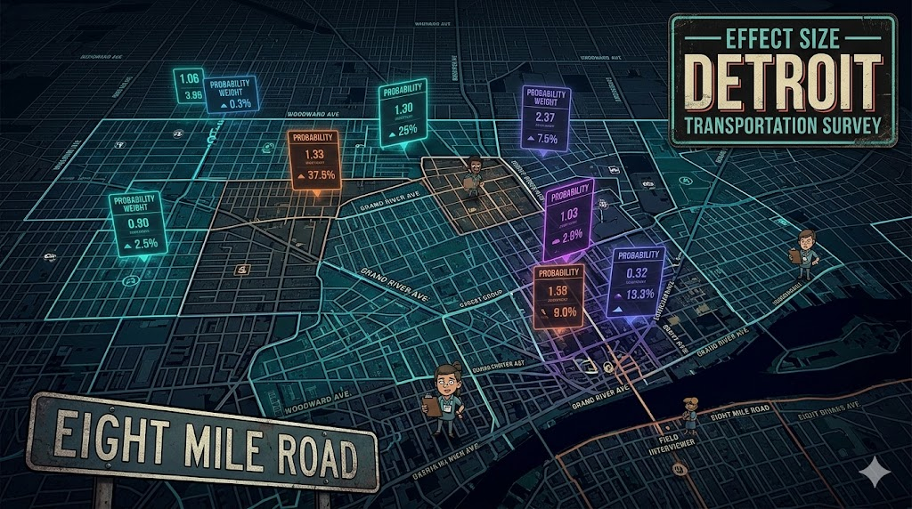

# detroit-transit-by-design

**Team Effect Size** | SURV745 — Practical Tools for Survey Design | Due 4/20/2026



## Overview

Three-stage area probability sample for a face-to-face survey on transportation insecurity among Detroit residents. Census tracts (PSUs) → block groups (SSUs) → persons, targeting 1,000 respondents across four age domains (18–34, 35–49, 50–64, 65+).

## Deliverables

- `REPORT_EffectSize.pdf` — Sampling report
- `FRAME1_EffectSize.csv` / `FRAME2_EffectSize.csv` — Tract- and BG-level frames
- `SAMPLE_EffectSize.csv` — Selected sample with probabilities and weights

## Setup

```r
install.packages(c("here", "tidyverse", "readxl", "survey", "PracTools", "srvyr",
                   "sf", "tigris", "tidycensus", "viridis", "patchwork", "sampling"))
```

Open `detroit-transit-by-design.Rproj` in RStudio. The `.Rprofile` sets the working directory via `here` and loads the input datasets on startup. Use `here()` for all paths — never absolute paths.

## Structure

```
data/raw/          Detroit_MI.xlsx, Census_Tract_FIPS_Code_Detroit_MI.csv
data/processed/    FRAME1, FRAME2, SAMPLE CSVs
R/                 01–05 analysis scripts (frame → MOS → selection → weighting → maps)
report/            REPORT_EffectSize.qmd
```

## Design parameters

- 40 PSUs, 1 BG per PSU, 1,000 respondents total
- Domain response rates: 0.35, 0.45, 0.50, 0.65 (18–34 through 65+)
- PPS systematic selection (`UPsystematic`, `set.seed(-77)`)
- 2020 Decennial DHC via `tidycensus`
